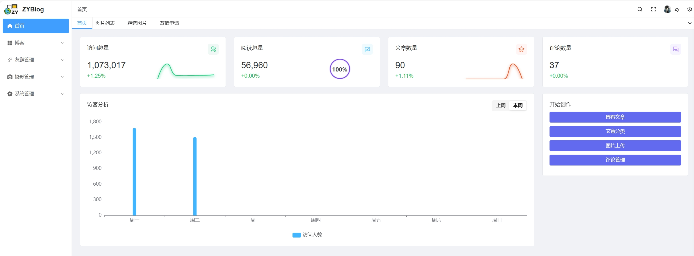
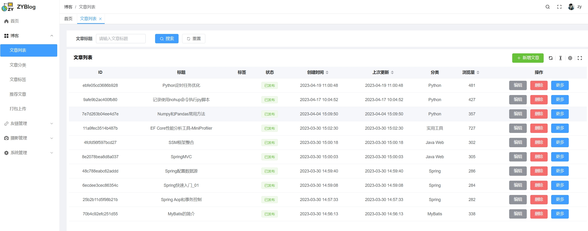
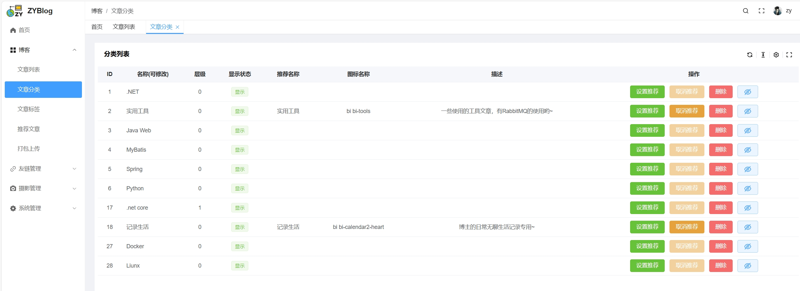
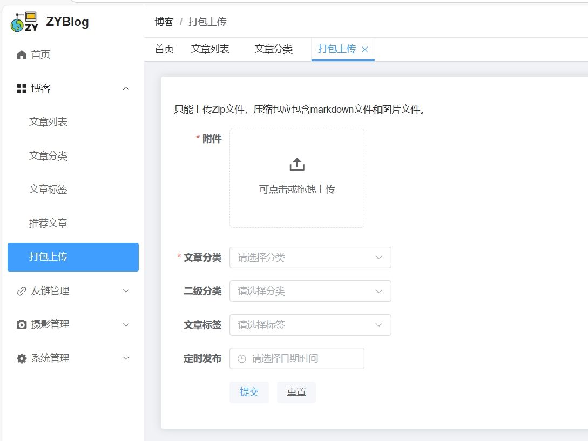
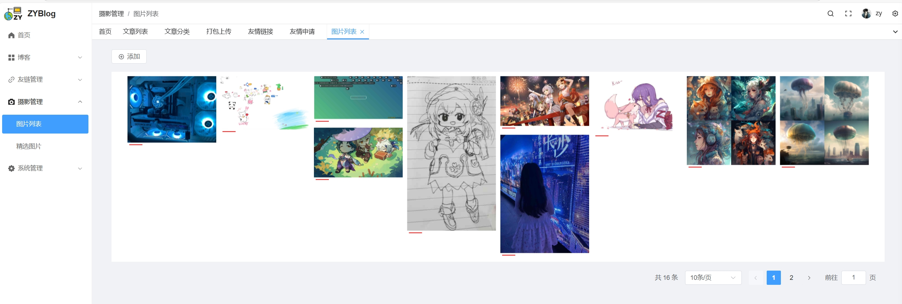
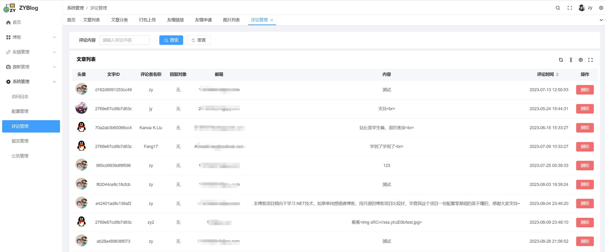

<h1>vue-zyblog-pure 基于vue-pure-admin框架的博客后台系统</h1>

[](LICENSE)

## 介绍

本项目基于 [vue-pure-admin](https://github.com/pure-admin/vue-pure-admin) 开发，原本博客后台使用[StarBlog](https://github.com/Deali-Axy/StarBlog)升级vue3版本搭建，鉴于被我改得烂七八糟，所以这次使用了新的架子搭建。

## 配套后端项目地址

更新之后后台地址：[ZyPLJ/ZYBlog: 这是Personalblog的新版本库，我将持续更新它。](https://github.com/ZyPLJ/ZYBlog)

老版本地址：[ZyPLJ/personalblog: 可以上传md文件的.net6个人博客系统。](https://github.com/ZyPLJ/personalblog)

老版本项目不再维护

## Gitee

前端：https://gitee.com/zyplj/vue-zyblog-pure

后端：https://gitee.com/zyplj/zyblog

## 部分截图













## 开发环境

[快速开始 | Pure Admin 保姆级文档](https://pure-admin.cn/pages/start/#开发环境) https://pure-admin.cn/pages/start/#开发环境

## 下载依赖

```
pnpm install
```

## 运行

```
pnpm dev
```

## 打包

```
pnpm build
```

## Docker部署

```dockerfile
docker build -t 容器名 .

docker run -d -p 8031:8031 --name 容器名 -v 服务器项目路径/dist:/usr/share/nginx/html 容器名
```

## 配套保姆级文档

vue-pure-admin提供了非常项目的开发和部署文档，可以根据自己的需求快速开发后台系统。

[点我查看 vue-pure-admin 文档](https://pure-admin.github.io/pure-admin-doc)

## 许可证

[MIT © 2020-present, pure-admin](./LICENSE)

## 遇到问题


